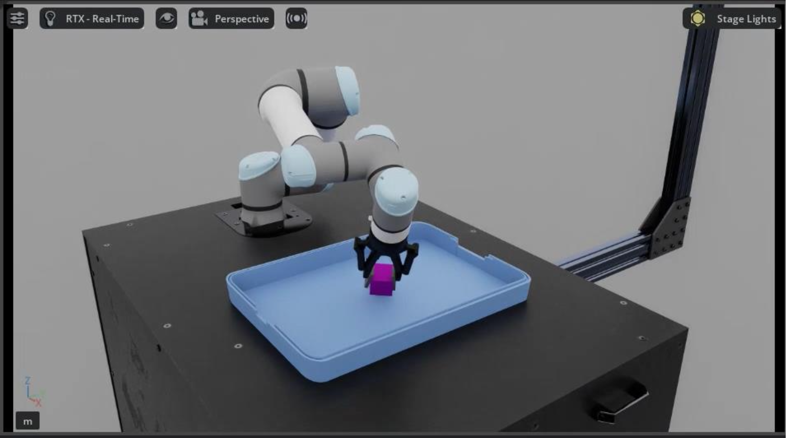
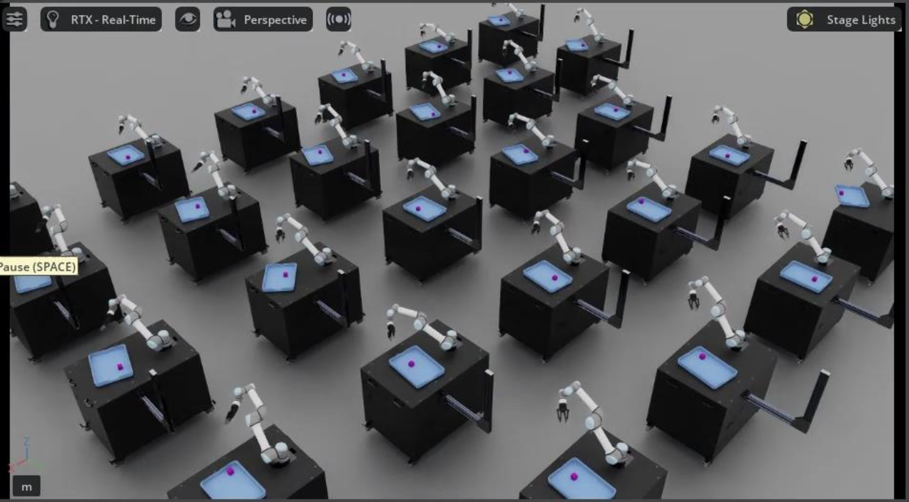
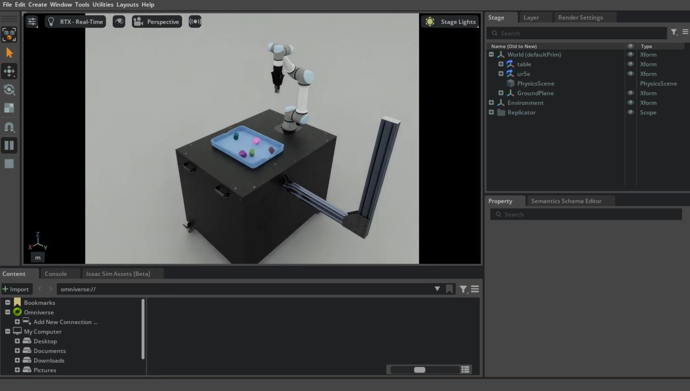
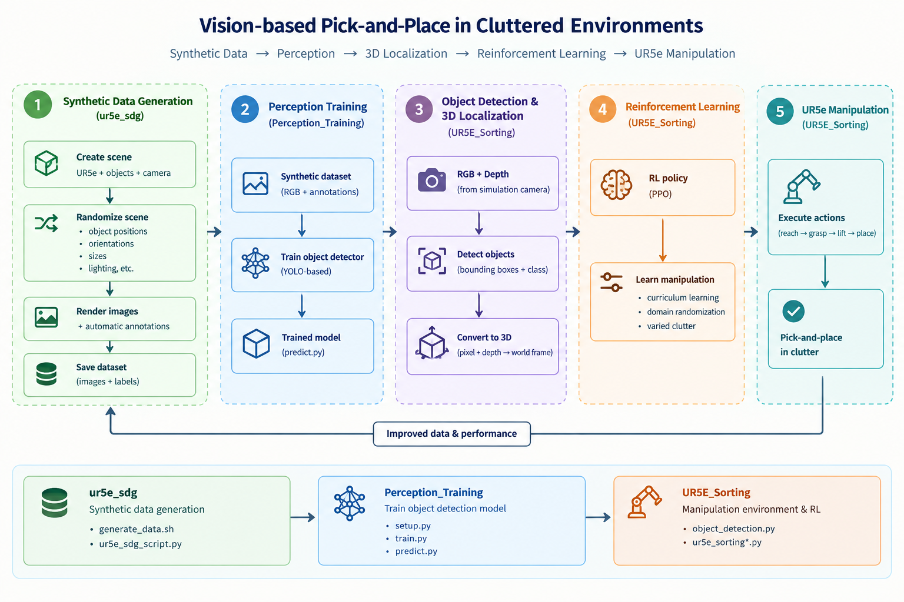
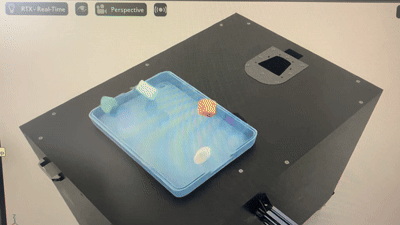
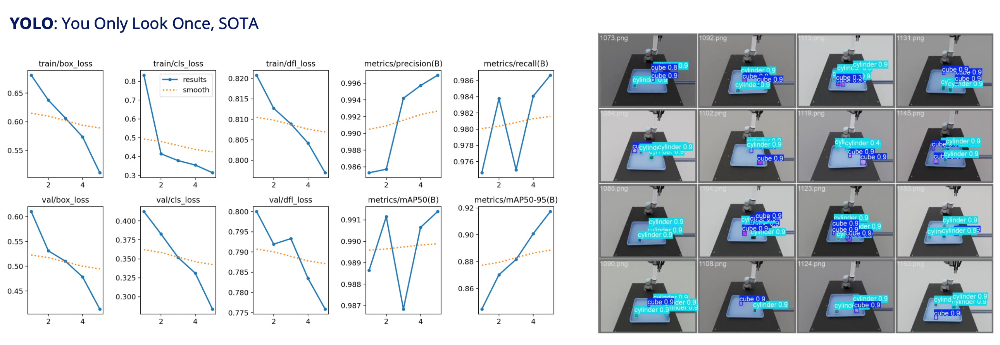

# Vision-based Pick-and-Place in Cluttered Environments

An NVIDIA Isaac Sim/Lab project that builds a full pipeline for vision-based pick-and-place with a UR5e arm in cluttered scenes. A reinforcement-learning policy controls the arm and gripper, while a perception model trained entirely on synthetic data localizes objects for the policy to act on.

<p align="center">
  
  &nbsp;&nbsp;&nbsp;
  
  &nbsp;&nbsp;&nbsp;
  
</p>

## How it works

The project is split into three sub-projects that form one pipeline, run in this order:

1. **[`ur5e_sdg`](./ur5e_sdg)** uses Isaac Sim's Replicator to render thousands of domain-randomized images of cubes and cylinders scattered in a tray, and automatically labels them (KITTI-format bounding boxes).
2. **[`Perception_Training`](./Perception_Training)** converts those labels to YOLO format and trains a YOLO object-detection model purely on the synthetic images.
3. **[`UR5E_Sorting`](./UR5E_Sorting)** trains a reinforcement-learning policy, in Isaac Lab, that drives a UR5e arm and gripper to reach, grasp, and lift a target object out of the clutter. During training the policy is given the object's ground-truth position; at inference/"play" time this is replaced by the trained perception model, which locates the object from an onboard RGB-D camera — so the two pipelines meet in a single vision-driven policy.

> **Why "UR5E_Sorting"?** The project originally aimed to sort objects by class. That goal was descoped to focus on the harder core problem — reliable vision-based pick-and-place in clutter — so the RL policy currently just picks up a target object. Turning this into a full sorting system is a matter of adding a simple classical motion-planning/placement routine on top of the existing pick primitive (place object class A in bin 1, class B in bin 2, etc.) — no additional RL is needed for that step.

| Sub-Project | Description |
| --- | --- |
| [`UR5E_Sorting`](./UR5E_Sorting) | Isaac Lab RL environment and training code for the UR5e pick-and-place policy, including the curriculum-learning clutter scheduler, reward functions, and the vision-in-the-loop "play" environment. |
| [`Perception_Training`](./Perception_Training) | Scripts to convert synthetic Replicator output into a YOLO-ready dataset and to train/run the object detector. |
| [`ur5e_sdg`](./ur5e_sdg) | Isaac Sim Replicator script for generating the synthetic, domain-randomized training images and annotations. |

<p align="center">
  
</p>

---

## 1. `ur5e_sdg` — Synthetic Data Generation

Generates a synthetic-data-generation (SDG) dataset for the perception model using Isaac Sim's Replicator API — no real images or manual labeling required.

**What it does (`ur5e_sdg_script.py`):**
- Loads a table/tray scene (`models/table_setup.usd`) and spawns a tray, cubes, and cylinders on top of it.
- Randomizes, every frame: ground-plane color, dome-light color/intensity, camera pose, tray pose, and the pose/scale/color/count of the cubes and cylinders (scattered on an invisible plane via `rep.randomizer.scatter_2d`).
- Assigns each object a semantic class (`cube` or `cylinder`) via Replicator semantics.
- Writes RGB images and 2D bounding-box/segmentation labels using Replicator's `KittiWriter`.

<p align="center">
  
</p>

**Usage:**

```bash
./generate_data.sh
```

This calls into Isaac Sim's bundled Python (`python.sh`) and runs the SDG script with the resolution and frame count set in the shell script:

```bash
./python.sh ur5e_sdg_script.py --height 960 --width 1280 --num_frames 1000 --data_dir <output_dir>
```

Update `ISAAC_SIM_PATH` at the top of `generate_data.sh` to point at your local Isaac Sim install. Output is written to `training_data/Camera/` (RGB images + KITTI-format labels), which feeds directly into `Perception_Training`.

---

## 2. `Perception_Training` — Object Detection

Trains a YOLO detector to find cubes and cylinders in the camera image, using only the synthetic data from `ur5e_sdg`.

**`setup.py`** — converts the raw Replicator output into a YOLO-ready dataset:
- Reads the KITTI-format labels and RGB images produced by `ur5e_sdg`.
- Converts KITTI bounding boxes (`x_min, y_min, x_max, y_max`) to normalized YOLO format (`x_center, y_center, width, height`).
- Performs an 80/20 train/validation split.
- Writes `data/classes.txt` and `data/dataset.yaml`, plus `data/train/{images,labels}` and `data/val/{images,labels}`.

```bash
python setup.py
```

**`train.py`** — fine-tunes a YOLO11-medium model on the generated dataset:

```bash
python train.py
```

```python
model = YOLO("yolo11m.pt")
model.train(data="data/dataset.yaml", imgsz=640, batch=8, epochs=5, workers=1, device=0)
```

Adjust `imgsz`, `batch`, `epochs`, and `device` as needed for your GPU/dataset size. Trained weights are saved under `runs/detect/train/weights/`.

**`predict.py`** — quick sanity check of the trained model on a single image:

```bash
python predict.py
```

<p align="center">
  
</p>

---

## 3. `UR5E_Sorting` — Reinforcement Learning Policy

An Isaac Lab `DirectRLEnv` task that trains a UR5e arm + parallel gripper to reach into a cluttered tray, track a target object, and lift it.

### Robot & scene (`ur5e_config.py`)
- UR5e articulation (6 arm joints + 2-finger gripper, controlled via implicit PD actuators) mounted on a table.
- The gripper is driven by a single binary-style action: negative closes the fingers, non-negative opens them (see `_apply_action`).

### Environment (`ur5e_sorting_env.py`, `ur5e_sorting_env_cfg.py`)
Each parallel environment spawns:
- A UR5e on a table, a tray, and up to `max_num_of_objects_class` cubes ("class A") and cylinders ("class B") each.
- A hidden holding area (`nonvisible_objects_tray`) — objects not currently "in play" for the curriculum are teleported here instead of being removed, which keeps the scene topology fixed while still controlling clutter density.
- One object per environment is picked as the **tracking object** for that episode; the policy is rewarded for reaching, orienting toward, and lifting that object without disturbing the others.

**Action space (7-D):** 6 arm joint-position targets + 1 gripper open/close command.

**Observation space (20-D, `robot_state`):** arm joint positions & velocities (6+6), gripper joint positions & velocities (2+2), the previous gripper action (1), and the tracking object's position relative to the robot base (3).

**Curriculum learning (clutter scheduling):**
Episodes start with only `starting_num_of_objects_class` visible objects per class (default 5). Starting at episode `start_adding_objects_episode`, one additional object per class is revealed every `adding_objects_episodes_interval` episodes, until `max_num_of_objects_class` (default 10) are visible — so the policy first learns to pick a mostly-isolated object before it has to cope with full clutter.

**Reward terms** (see `mdp/rewards.py`, combined in `compute_rewards`):

| Term | Purpose |
| --- | --- |
| `ee_pos_track_rew` | Penalizes end-effector distance to the target object |
| `ee_pos_track_fg_rew` | Fine-grained (tanh-shaped) bonus for closing in on the object |
| `ee_orient_track_rew` | Rewards a suitable gripper orientation for grasping |
| `ground_hit_avoidance_rew` | Discourages the arm from driving into the table/ground |
| `joint_2_tuning_rew` | Keeps the shoulder-lift joint in a sensible range |
| `gripper_rew` | Rewards closing the gripper once it's positioned at the object |
| `object_moved_rew` | Penalizes knocking other (non-target) objects around |
| `joint_vel_rew` / `action_rate_rew` | Small penalties for jerky, high-velocity motion |

Weights for each term are set in `UR5ESortingEnvCfg` and can be tuned per training run.

### Training vs. Play — where perception comes in
- **`UR5ESortingEnv`** (training): uses the *ground-truth* simulator position of the tracking object as part of the observation. This is what the RL policy is actually trained against — fast, and free of perception noise.
- **`UR5ESortingEnv_Play`** (`UR5ESortingEnvCfg_Play`): adds a `TiledCamera` (RGB-D) to the scene and, in `_get_observations`, replaces the ground-truth object position with an estimate from `object_detection.py`: the trained YOLO model detects the object in the RGB image, its depth is read from the depth channel at the detection's center pixel, and the camera intrinsics are used to back-project this into a 3D point, which is then transformed from the camera frame into the robot base frame. This is the environment used to evaluate the policy the way it would actually run on vision alone.

### Usage

This task follows Isaac Lab's standard workflow: the environment/config classes above are registered as a Gymnasium task, then trained and evaluated with Isaac Lab's own `train.py` / `play.py` entry points (e.g. via `rsl_rl` or `rl_games`), for example:

```bash
# Train (ground-truth object position, no camera)
python <isaaclab_path>/scripts/reinforcement_learning/<rl_library>/train.py --task <your-registered-task-id> --num_envs 4096 --headless

# Play / evaluate with the vision pipeline (requires the camera)
python <isaaclab_path>/scripts/reinforcement_learning/<rl_library>/play.py --task <your-registered-task-id>-Play --enable_cameras --checkpoint <path-to-checkpoint>
```

> Replace `<isaaclab_path>`, `<rl_library>`, and `<your-registered-task-id>` with your local setup — see your task registration (`__init__.py`) for the exact task ID. The `--enable_cameras` flag is required for the `_Play` variant since it uses a `TiledCamera`.

---

## Requirements

- [NVIDIA Isaac Sim](https://developer.nvidia.com/isaac-sim) and [Isaac Lab](https://github.com/isaac-sim/IsaacLab)
- Python (matching your Isaac Sim/Lab install) with:
  - `torch`
  - [`ultralytics`](https://github.com/ultralytics/ultralytics) (YOLO)
- An NVIDIA GPU (RTX recommended for RayTracedLighting rendering and RL throughput)

## Repository structure

```
vision-based-pick-place-in-clutter/
├── ur5e_sdg/              # Synthetic data generation (Isaac Sim Replicator)
├── Perception_Training/   # YOLO dataset prep, training, inference
└── UR5E_Sorting/          # Isaac Lab RL environment, config, and vision-in-the-loop play env
```

## Acknowledgments

- Built on [NVIDIA Isaac Sim](https://developer.nvidia.com/isaac-sim) and [Isaac Lab](https://github.com/isaac-sim/IsaacLab).
- Object detection powered by [Ultralytics YOLO](https://github.com/ultralytics/ultralytics).

## License

This project is licensed under the MIT License — see [LICENSE](./LICENSE) for details.
